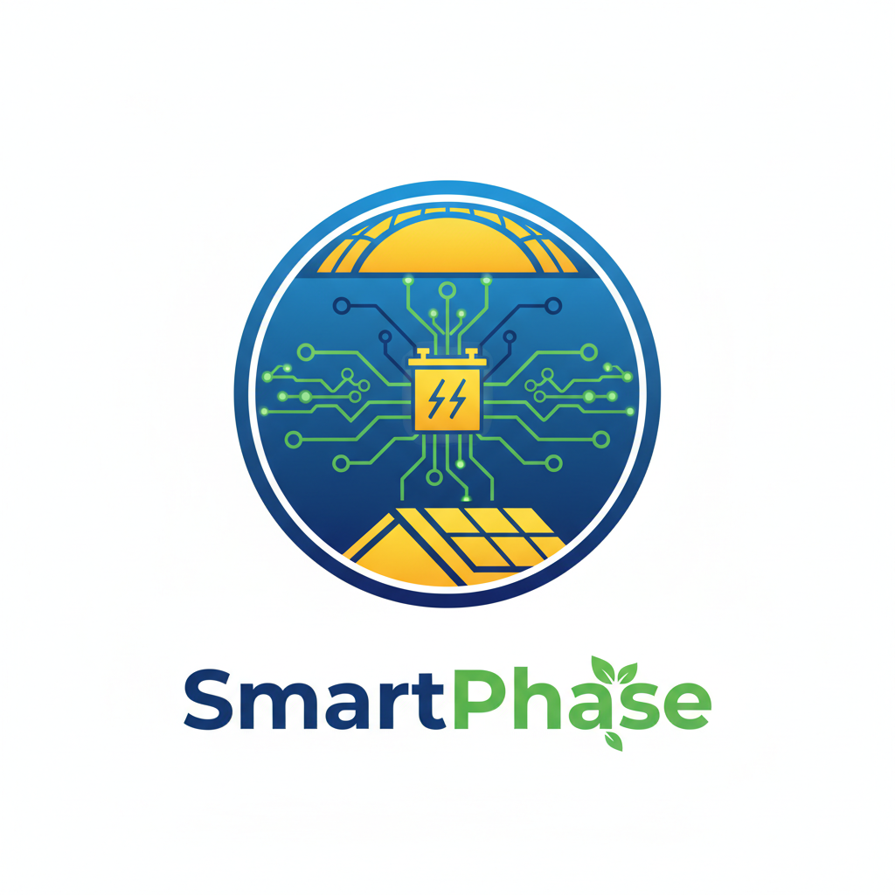
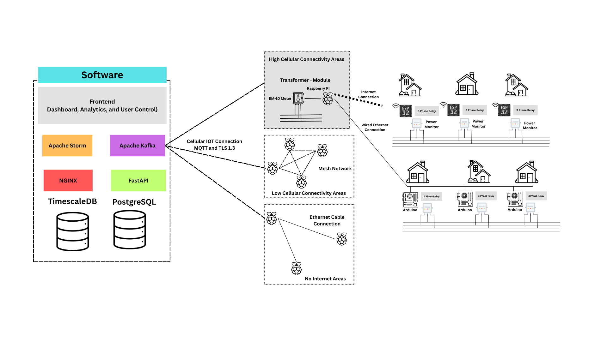
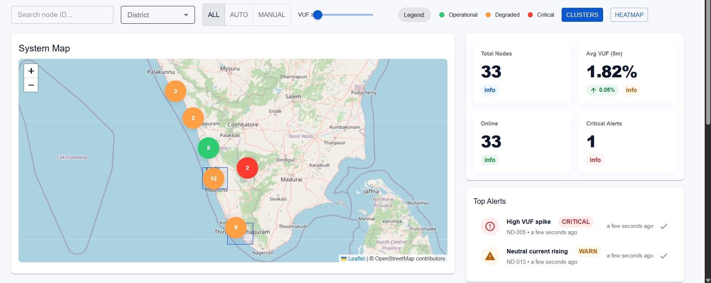

<!-- 🎯 PROJECT BANNER -->

  

<h1 align="center">⚡ Smart Phase Balancing and Hybrid IoT Power Distribution System</h1> 

  <b>Scalable | Secure | Sustainable | Smarter Power for the Future</b> 
  <i>An Intelligent, Hybrid IoT Architecture for Next-Generation Energy Management</i> 

---

---

## 🌍 Overview

Kerala’s energy infrastructure is evolving — and with it comes the challenge of ensuring **efficient, balanced, and intelligent power distribution** across every region.  
Our solution, the **Smart Phase Balancing and Hybrid IoT Power Distribution System**, redefines how transformers and homes communicate, coordinate, and optimize electricity delivery.

This project builds a **self-learning, hybrid IoT architecture** that connects every household node and transformer to a central intelligence layer — providing **real-time visibility**, **load balancing**, and **automated control** across both **urban and rural** grids.

It’s more than just monitoring — it’s about creating a power network that can *sense, decide, and act*.

---

> ⚡ **Built for Scalability. Designed for Security. Engineered for Real-Time Performance.**

---

## 🎯 Why This Matters

Kerala’s power grid spans a complex mix of **dense city networks, campuses, and rural terrains**.  
While urban regions are data-rich, rural and hilly areas still lack connectivity — resulting in **phase imbalance, transformer overloads, and manual dependency.**

Our system ensures that *no matter the terrain*, **every node, every transformer, and every watt of energy** is monitored, managed, and optimized.  
This architecture directly supports **KSEB’s vision for a Smart, Connected Kerala**, integrating renewable energy and improving grid resilience.

---

### 🚀 What Makes It Different

| Feature | Traditional Grid | Our Smart Grid |
|----------|------------------|----------------|
| Phase Monitoring | Manual, delayed | Real-time IoT sensing |
| Control | Manual switchovers | Automated balancing logic |
| Connectivity | Wired or single-channel | Hybrid (Cellular + LoRa + Wired) |
| Data Handling | Limited local logging | State-wide data ingestion & analytics |
| Scalability | Transformer-level | State-wide, modular, and scalable |
| Security | Minimal | TLS + AES + Role-Based Control |

> 🧠 *This isn’t just digitalization — it’s intelligence built into every transformer.*

---

## 💡 Core Objective

Our primary goal is to design a **modular, scalable, and cost-efficient hybrid IoT ecosystem** that enables smart, automated, and secure energy distribution.

### ✅ System Objectives

- Detect **phase imbalance and transformer overloads** automatically in real time.  
- Ensure **reliable communication** between every home node, transformer, and control center using hybrid connectivity.  
- Optimize **energy flow and distribution efficiency** with autonomous local decision-making at the edge.  
- Deliver **real-time dashboards and analytics** for monitoring, alerts, and performance insights.  
- Maintain **data security and compliance** through encryption, authentication, and audit tracking.  
- Support **urban, campus, and rural topologies** under one unified architecture.  
- Align with the **Smart India Mission** and **KSEB’s modernization roadmap** for sustainable grid transformation.

---

### 🧩 Design Essence

> **“Every transformer thinks. Every node communicates. Every decision optimizes the grid.”**

Our design philosophy is grounded in three pillars:

1. ⚙️ **Modularity** – Independent components (hardware, software, communication) that integrate seamlessly.  
2. 🧠 **Intelligence** – Edge analytics and centralized data insights for predictive and preventive action.  
3. 🔒 **Security & Reliability** – Multi-layer protection ensuring trusted and resilient energy communication.

---

  

> *Smart distribution starts at the transformer — but intelligence begins at every node.*

---

## 🔩 4. Hardware Architecture

Electricity distribution begins at the **transformer** and the **household node** — our design ensures that *intelligence is embedded at the point of action*.  
The system operates on a distributed model where each hardware layer — home node, transformer PI, and gateway — contributes to real-time balance, control, and reporting.

---

### 🏠 Home Node Unit

Each connected home is equipped with a **Smart Node Module**, built around low-cost yet reliable microcontrollers that can **measure, communicate, and act**.

**Key Components**
- ⚡ **Microcontroller:** Arduino or ESP32 for real-time control and data handling.  
- 🧲 **Sensors:** PZEM-004T or equivalent modules to measure current, voltage, and power factor.  
- 🔄 **3-Phase Relay Module:** Dynamically switches household load between phases under PI command.  
- 📡 **Communication Interface:** RS-485 (wired) or LoRa/Wi-Fi (wireless) for reliable connectivity.

**Functions**
- Constantly monitors power flow and sends updates to the transformer-level PI.  
- Switches phases autonomously when instructed or during local instability.  
- Can detect anomalies such as overcurrent or reverse feed from solar sources.  
- Capable of limited edge processing — reducing unnecessary communication load.

> 🧠 *Each home node acts as a “thinking endpoint” — small in size, big in intelligence.*

---

### 🧠 Transformer PI Unit

At the center of each transformer sits a **Raspberry Pi-based controller**, the real-time decision-maker of the network.

**Core Responsibilities**
- Aggregates readings from 50–100 connected home nodes.  
- Continuously evaluates **phase balance, load deviation, and power quality**.  
- Executes control signals to nodes for **instant phase reallocation**.  
- Communicates summarized reports to the Central Control Center (server).  

**Integrated Features**
- **Computation:** Load-balancing algorithm for rapid phase switching.  
- **Preprocessing:** Data aggregation and anomaly detection before transmission.  
- **Connectivity:** Cellular IoT (NB-IoT / LTE-M) or LoRa mesh uplink.  
- **Metering:** Uses modules like EM-10 for precise 3-phase monitoring.  
- **Local Storage:** Temporary SQLite buffer for outage resilience.  

> “Where traditional transformers stop at distribution — ours begins with intelligence.”

---

### 🧭 Gateway PI

In low-connectivity areas, a designated **Gateway PI** collects data from nearby PIs via LoRa and pushes it to the control center using a stronger cellular link.

- Acts as a **local data hub** for multiple transformers.  
- **Reduces SIM usage** and overall communication cost.  
- Ensures **complete coverage**, even in rural or hilly terrains.

---

> *Hardware built for field reality — rugged, scalable, and ready for automation.*

---

## 🌐 5. Communication Architecture

The network is the **spinal cord** of this entire system — securely carrying commands, events, and data across mixed geographies.  
Our design follows a **Hybrid IoT Connectivity Model**, ensuring every transformer remains online, regardless of infrastructure constraints.

---

### ⚡ Dense Urban & Residential Clusters
- **Communication:** RS-485 wired between meters and PI.  
- **Why:** Short distances, minimal noise, and near 100% uptime.  
- **Advantage:** No interference, low cost, and highly accurate load reporting.  
✅ **Goal:** Maximum reliability and accuracy in compact areas.

---

### 🏢 Campus or Multi-Feeder Networks
- **Communication:** RS-485 within each feeder + LoRa uplink to the central PI.  
- **Why:** Reduces cabling mess across wide areas (100–500m).  
- **Advantage:** Local wired stability combined with long-range wireless communication.  
✅ **Goal:** Maintain feeder-level precision while covering larger distances.

---

### 🌄 Rural or Widely Spaced Transformers
- **Communication:** LoRa wireless nodes → Gateway PI → Control Center.  
- **Why:** Long-range communication (up to 10 km), low power, solar-compatible.  
- **Advantage:** Enables rural electrification without costly infrastructure.  
✅ **Goal:** Reliable long-range telemetry for remote grids.

---

### 📡 Connectivity Summary

| Environment | Communication Mode | Range | Reliability | Cost | Ideal Use Case |
|--------------|--------------------|--------|--------------|------|----------------|
| Urban | RS-485 (Wired) | <100 m | ⭐⭐⭐⭐ | 💰 Low | Streets, dense housing |
| Campus | LoRa + RS-485 | 0.5–2 km | ⭐⭐⭐⭐ | 💰💰 Moderate | Institutions, feeders |
| Rural | LoRa → Gateway PI | 1–10 km | ⭐⭐⭐ | 💰 Very Low | Villages, farmlands |

> 🛰️ *From cables to the cloud — our hybrid network ensures every watt is heard.*

---

## ⚙️ 6. Software & Data Architecture

Beneath the field layer lies the **digital intelligence stack** — the system’s analytical brain that transforms raw energy readings into actionable insights.

Our software architecture is modular, secure, and horizontally scalable — designed to handle **thousands of simultaneous PI connections** while maintaining real-time responsiveness.

---

### 🧾 Data Ingestion Layer
- **Protocol:** MQTT over TLS — lightweight and secure IoT communication.  
- **Message Broker:** Apache Kafka — high-throughput stream ingestion for continuous PI data.  
- **Edge Preprocessing:** PI filters redundant data to reduce transmission volume.  

> Kafka acts as the digital artery — buffering and streaming millions of readings without data loss.

---

### 💾 Data Storage Layer
- **TimescaleDB:** Optimized for time-series IoT data — fast reads and writes.  
- **PostgreSQL:** Stores metadata, configurations, and user information.  
- **On-Premise Data Lake (HDFS / NFS):** Retains historical records for audits and AI-based forecasting.  

> *Every second of power history — preserved, queryable, and meaningful.*

---

### 📊 Data Analytics & Processing
- **Apache Storm:** Real-time stream processor detecting anomalies, overloads, and phase imbalances.  
- **Apache Druid:** Batch analytics engine performing trend and capacity studies.  
- **Visualization Layer:** Grafana and Apache Superset for dashboards, alerts, and control views.  

> *From milliseconds to months — every insight drives smarter decisions.*

---

### 🌐 API & Dashboard Layer
- **Backend Framework:** Python (FastAPI) + NGINX for secure routing.  
- **Frontend:** React.js for responsive, modular dashboards.  
- **Visualization:** Grafana for live status; Superset for analytics.  
- **Communication:** REST and MQTT APIs for real-time control and data sync.  

> Control, visualize, and act — all from a single unified interface.

---

  

> 💬 *From field data to decision dashboards — intelligence flows seamlessly through every layer.*

---

## 🔒 7. Security & Reliability Framework

In critical infrastructure like the power grid, **security and reliability are non-negotiable**.  
Our architecture embeds protection, resilience, and compliance **at every layer** — from field hardware to analytics servers.

This ensures that all data remains **authentic, encrypted, and tamper-proof**, while operations continue seamlessly even during outages or network fluctuations.

---

### 🧱 Layered Security Model

| Layer | Security Mechanism | Purpose |
|--------|--------------------|----------|
| **Communication** | TLS 1.3 Encryption | Secures data transmission between PI units and Control Center, preventing interception. |
| **Storage** | AES-256 Encryption | Protects data at rest within databases and logs, ensuring confidentiality and compliance. |
| **Access Control** | JWT + RBAC | Provides authenticated and role-based access for users and devices. |
| **Network** | VPN + Firewalls | Isolates the internal communication network, blocking unauthorized intrusion. |
| **Governance** | Audit Logging System | Tracks all configuration changes, access events, and control actions for traceability. |

> *Security is not an afterthought — it’s embedded by architecture.*

---

### 🧠 Why These Measures Matter

- **TLS 1.3:** Prevents data theft or man-in-the-middle attacks during communication.  
- **AES-256:** Ensures that even if storage is breached, data remains unreadable.  
- **JWT Authentication:** Blocks unauthorized logins and protects sensitive control APIs.  
- **RBAC:** Limits user operations — only authorized roles can trigger control actions.  
- **VPN & Firewalls:** Shield the network backbone from external interference.  
- **Audit Logs:** Enable forensic tracing and compliance with KSEB cybersecurity norms.  

Together, these measures **prevent breaches, spoofing, and unauthorized command injection**, ensuring a **trusted and resilient network** for smart power control.

---

### ⚙️ Reliability & Fail-Safe Mechanisms

Security is complemented by **robust reliability features** that guarantee uptime and operational continuity:

| Mechanism | Description |
|------------|-------------|
| **Local Edge Autonomy** | Each PI can operate independently when connectivity is lost — continuing to balance loads locally. |
| **Data Buffering** | Temporary local storage using SQLite ensures no data loss during transmission breaks. |
| **Failover Servers** | Backup servers in the Control Center replicate key services for uninterrupted operation. |
| **Automated Backups** | Scheduled daily and weekly backups protect against hardware failure. |
| **Redundant Communication Channels** | Multiple paths (Cellular, LoRa, Wired) ensure data flow continuity in any condition. |

> 🔁 *The grid never sleeps — neither does its monitoring.*

---

### 🛡️ Compliance & Standards

Our design aligns with key **government and industry-grade security frameworks**:

- **KSEB IT & Data Protection Policies**  
- **CERT-In Cybersecurity Guidelines for Critical Infrastructure**  
- **ISO/IEC 27001** – Information Security Management  
- **National Smart Grid Mission (NSGM) Standards**  

By adhering to these, the system guarantees **national-level cybersecurity readiness** while maintaining local deployment feasibility.

---

> *Power you can trust — secured by design, resilient by architecture.*

---

## 🧭 8. Monitoring, Reliability & Maintenance

A truly smart system doesn’t just work — it **monitors itself, repairs itself, and reports intelligently.**  
Our monitoring and reliability framework ensures that every device, every connection, and every process in the network stays healthy, responsive, and optimized 24×7.

---

### ⚙️ System Monitoring Infrastructure

We use **open-source observability tools** that continuously monitor hardware, communication links, and data flow in real time.

| Component | Tool Used | Purpose |
|------------|------------|----------|
| **System Metrics** | Prometheus | Tracks CPU usage, memory, network latency, and ingestion rates. |
| **Visualization** | Grafana | Displays real-time dashboards for health, performance, and alerts. |
| **Central Logging** | ELK / EFK Stack | Aggregates logs from every Raspberry Pi, server, and API for quick fault diagnosis. |
| **Network Health** | Ping & MQTT Response Tracker | Measures packet loss, latency, and node availability. |
| **Device Status** | Heartbeat Protocol | Each PI sends periodic pings to confirm operational state. |

> *Continuous monitoring transforms potential failures into proactive fixes.*

---

### 🔁 Automated Alerts & Response

Real-time alerts are automatically triggered when anomalies occur — ensuring **faster human response** and **system resilience**.

| Event Type | Trigger | Response Mechanism |
|-------------|----------|--------------------|
| Transformer Overload | Voltage/Current Threshold Crossed | Alert to Dashboard + PI auto-balancing command |
| Communication Failure | No data heartbeat > 2 min | Local buffering + Email/SMS alert |
| Device Fault | Node unresponsive | Field engineer notification + log capture |
| Data Spike / Noise | Unusual input pattern | Temporary isolation + flagged for inspection |

Alerts can be sent to:
- **Government / KSEB Engineers:** via SMS or Email notifications.  
- **Dashboard Operators:** via Grafana or Web Portal alerts.  
- **Field Maintenance Teams:** via Telegram/Slack integrations.

> 🧠 *We don’t wait for faults — we anticipate and prevent them.*

---

### 🔄 Reliability & Maintenance Features

Reliability is achieved through a combination of **redundancy, fail-safes, and modularity**.

| Feature | Description |
|----------|--------------|
| **Failover Servers** | Backup servers mirror real-time data streams and analytics processes. |
| **Automated Backups** | Daily and weekly snapshots protect all configurations and historical data. |
| **Local Data Caching** | SQLite buffers data on each PI during network failures. |
| **Self-Healing Services** | Scripts auto-restart critical services like MQTT or Kafka in case of crash. |
| **Versioned Deployments** | Updates are rolled out gradually — ensuring no downtime. |
| **Edge Continuity Mode** | PI continues to balance load locally even when disconnected from the control center. |

> 🛠️ *The grid never sleeps — neither does its maintenance.*

---

### 📈 Data Retention & Lifecycle Management

To ensure long-term traceability and analytics potential, the system retains and manages data efficiently:

- **Live Operational Data:** Stored in TimescaleDB for 1 year.  
- **Archived Historical Data:** Moved to Data Lake (HDFS/NFS) after 12 months.  
- **Analytical Summaries:** Compressed and retained indefinitely for policy insights.  

This approach ensures **cost-efficiency, scalability, and analytical depth** — even over decades of operation.

---

> *Reliability isn’t achieved by redundancy alone — it’s designed into every process.*

---

## 🧠 9. Software Technology Summary

Our software stack is **modular, fully open-source, and optimized for scalability and security.**  
Every layer — from the field edge to the control dashboard — is engineered for **real-time performance** and **government-level reliability**.

---

### 🏢 Central Control & Processing Layer

| Technology | Role |
|-------------|------|
| **Apache Kafka** | Message broker handling large-scale data ingestion from PIs. |
| **Apache Storm** | Real-time stream processing for instant overload and imbalance detection. |
| **Apache Druid** | Batch analytics for long-term performance trends and capacity planning. |
| **TimescaleDB + PostgreSQL** | Hybrid database for time-series and configuration management. |
| **NGINX + FastAPI (Python)** | Backend API and gateway layer for secure system communication. |

---

### ⚙️ Edge Layer (Transformer PI)

| Technology | Role |
|-------------|------|
| **Raspberry Pi OS (Linux)** | Local processing platform for edge intelligence. |
| **Python Edge Scripts** | Executes real-time phase balancing and data filtering. |
| **Paho MQTT Client** | Publishes encrypted readings to central servers. |
| **SQLite Buffer** | Local data caching for resilience during outages. |

---

### 💻 Dashboard & Visualization

| Technology | Role |
|-------------|------|
| **React.js** | Frontend framework for responsive, modular UI. |
| **Grafana** | Real-time visualization and system monitoring. |
| **Apache Superset** | Advanced data analytics and reporting tool. |
| **Prometheus** | Collects metrics from all running services. |

---

### 🔐 Security & Network Framework

| Technology | Role |
|-------------|------|
| **TLS 1.3 + AES-256** | Encryption for data in transit and at rest. |
| **JWT + RBAC** | Authentication and role-based control of system access. |
| **VPN + Firewalls** | Secure, isolated communication network. |
| **Audit Logging System** | Tracks all user actions and system events. |

---

### 📡 Communication Protocols

| Protocol | Use |
|-----------|-----|
| **MQTT (over TLS)** | Lightweight, secure IoT communication between PI and control center. |
| **RS-485 (Modbus RTU)** | Wired connection between meters and PIs in dense areas. |
| **LoRa** | Long-range, low-power connectivity in rural networks. |
| **HTTP / HTTPS** | Secure REST communication for dashboards and APIs. |

---

### ⚙️ Monitoring & DevOps Tools

| Tool | Function |
|-------|-----------|
| **Prometheus + Grafana** | Real-time metrics and health visualization. |
| **ELK / EFK Stack** | Centralized log collection and analysis. |
| **Docker** | Containerized deployment for scalability and isolation. |
| **Git & GitHub** | Version control and collaborative development. |

---

### 🧩 Architectural Highlights

| Attribute | Description |
|------------|-------------|
| **Modular Design** | Each layer (Hardware, Network, Software) operates independently yet integrates seamlessly. |
| **Scalable Infrastructure** | Kafka + TimescaleDB handle thousands of parallel streams with low latency. |
| **Edge Intelligence** | Local PI computation reduces bandwidth and improves reaction time. |
| **Secure by Design** | Encryption, authentication, and auditing at every level. |
| **Interoperable** | Compatible with KSEB’s existing SCADA and Smart Grid infrastructure. |
| **Cost-Efficient** | Fully open-source and on-premise deployment — no cloud cost burden. |

---

> *An end-to-end software ecosystem — open, secure, and built for scale.*

---

## 🌟 10. Expected Impact

Our system doesn’t just solve a technical challenge — it transforms how Kerala manages power distribution.  
By embedding intelligence into every transformer and home node, the **Smart Phase Balancing System** delivers measurable operational, economic, and environmental impact.

---

### ⚡ Quantifiable Technical Impact

| Impact Area | Description | Estimated Improvement |
|--------------|--------------|------------------------|
| **Load Balancing Efficiency** | Dynamic switching reduces transformer phase imbalance. | Up to **90% reduction** in imbalance duration. |
| **Energy Loss Reduction** | Reduces technical losses caused by overloading and uneven distribution. | **5–8%** decrease in total losses. |
| **Transformer Longevity** | Balanced loads and predictive alerts reduce wear and stress. | **20–25% longer equipment life.** |
| **Fault Detection Time** | Real-time monitoring detects anomalies instantly. | From hours → **seconds**. |
| **Connectivity Coverage** | Hybrid IoT model ensures rural inclusion without heavy infrastructure. | **100% transformer coverage.** |

> *Each percentage saved is power returned to Kerala’s people.*

---

### 💰 Economic & Operational Benefits

- **Reduced maintenance costs** due to predictive analytics and automatic fault identification.  
- **Low operational cost:** Minimal recurring expenditure (₹20–₹50/month per PI via IoT SIMs).  
- **Zero cloud dependency:** Fully on-premise architecture prevents third-party expenses.  
- **Scalable deployment:** Compatible with existing transformers — no need for redesign.  
- **Efficient workforce utilization:** Engineers can monitor multiple transformers remotely.  

---

### 🌿 Environmental & Social Impact

- **Energy savings** directly reduce the carbon footprint and energy purchase requirements.  
- **Improved reliability** ensures uninterrupted power for industries, homes, and public services.  
- **Supports renewable integration** (solar rooftop and distributed energy sources).  
- **Empowers rural communities** with modern grid access and stable power supply.  
- **Aligns with India’s vision for Smart, Green, and Sustainable Infrastructure.**

> 🔋 *A smarter grid today builds a cleaner tomorrow.*

---

## 🌱 11. Sustainability & SDG Alignment

Our project aligns with multiple **United Nations Sustainable Development Goals (SDGs)**, reinforcing its global relevance and long-term purpose.

| SDG | Goal | Contribution |
|------|------|--------------|
| **SDG 7** | Affordable & Clean Energy | Real-time energy optimization ensures efficient and inclusive power access. |
| **SDG 9** | Industry, Innovation & Infrastructure | Strengthens national smart grid infrastructure with scalable IoT and data systems. |
| **SDG 11** | Sustainable Cities & Communities | Provides reliable power distribution to support urban and rural sustainability. |
| **SDG 12** | Responsible Consumption | Reduces wastage and improves the efficiency of resource utilization. |
| **SDG 13** | Climate Action | Minimizes energy losses and contributes to lower greenhouse gas emissions. |

> *Technology aligned with sustainability — progress with purpose.*

---

## 👥 12. Team & Credits

Behind every system of intelligence lies a team of dedication.  
Our group blends expertise from **electronics, computer science, and energy engineering** — united by one vision: **to make Kerala’s power grid smarter, stronger, and sustainable.**

| Role | Name | Responsibility | Email ID |
|------|------|----------------|-----------|
| **Team Lead** | Gokul Ram K | System Architecture, Software Design, Integration, API Development, and Data Visualization | gokulram.k2023@vitstudent.ac.in |
| **Hardware Engineer** | Varun Krishnan R | Home Node & Transformer Module Design & Integration | varun.krishnan2023@vitstudent.ac.in |
| **Networking Specialist** | Manju Varshikha S | Home Node Design, IoT Connectivity, and Communication Layer Implementation | manjuvarshikha.s2023@vitstudent.ac.in |
| **Software Developer** | Raghav Sivakumar | Central Dashboard, API Development, and Data Visualization | raghav.sivakumar2023@vitstudent.ac.in |
| **Software Developer** | Logeswarar G | Data Security, Encryption, and Real-Time Monitoring Modules | logeswarar.2023@vitstudent.ac.in |
| **Security & Data Analyst** | Karthikeyan Arun | Data Validation, Threat Analysis, and System Documentation | Karthikeyan.arun2023@vitstudent.ac.in |

> 💡 *Innovation is teamwork — and our team powers innovation.*

---

## 📞 13. Contact:

---

**Organization:** Smart India Hackathon (Government of Kerala)  
**Institution:** Vellore Institute of Technology, Chennai
**Email:** gokulram.k2023@vitstudent.ac.in
**Location:** Chennai, India 

  

<h4 align = "center"> Our Demo Work in VIT - Round 2 (Competed Against 850+ teams and made it to TOP 30 after 2 internal rounds!! Internal Round Winners!!) </h4>
<H4 align= "center" > The Only Team moving to National Level Competition in Our PS: 25064 </H4>

---

  

<h3 align="center">⚡ Smart Grid. Smarter Kerala. ⚡</h3>

  <i>Building the backbone of a sustainable energy future — one transformer at a time. </i>

---

