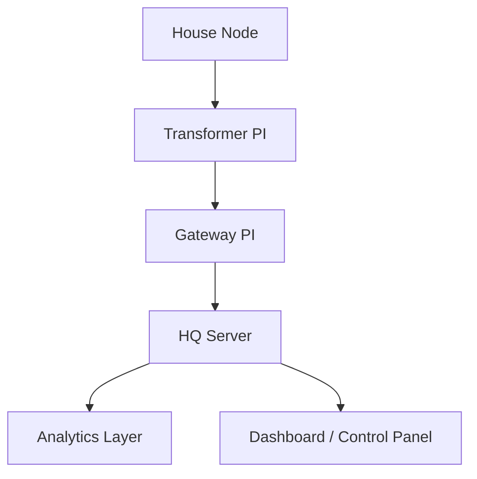

<!-- 🎯 PROJECT BANNER -->

  

<h1 align="center">⚡ Smart Phase Balancing and Hybrid IoT Power Distribution System</h1>

  <b>Scalable | Secure | Sustainable | Smarter Power for the Future</b> 
  <i>An Intelligent, Hybrid IoT Architecture for Next-Generation Energy Management</i>

---

---

## 🌍 Overview

Our project introduces a **hybrid IoT-based architecture** designed to monitor, control, and balance transformer phases in real time — ensuring **efficiency, reliability, and cost-effectiveness** across both **urban and rural grids**.

This system integrates **smart hardware nodes**, **Raspberry Pi units**, and a **multi-layered data infrastructure** that communicates securely with a **central HQ server**.

> ⚡ Built for scalability, designed for security, and optimized for real-time performance.

---

## ⚠️ Problem Statement

Electric power grids today face severe **phase imbalance and load inefficiency** due to:
- Manual phase monitoring ⚙️  
- Overloaded transformers and frequent outages 🔥  
- Lack of real-time visibility and data-driven decision-making 📊  
- High dependency on manual inspection and maintenance 👷  

Such inefficiencies lead to **energy loss, equipment stress, and service instability**, especially in regions with **varying network conditions** (dense cities vs rural areas).

---

## 💡 Core Objective

To design a **scalable, secure, and cost-effective hybrid IoT system** that:
- Automatically **detects and balances transformer loads** in real-time  
- Enables **reliable communication** from every node to the HQ server  
- Supports **urban, campus, and rural topologies** with adaptive connectivity  
- Aligns with **Smart India’s vision of sustainable energy management** ⚡  

---

## 🔁 PI → HQ Server Connectivity Plan

### 🛰️ Cellular IoT Overview

- Cellular IoT (NB-IoT / LTE-M / 5G) is widely used in **smart meter grids** across India.
- Government bodies can **partner with telecom providers** for **IoT SIMs** with minimal monthly cost.
- Estimated cost: **₹20–₹50 per month per PI**, depending on data usage.

---

### 🔹 **1️⃣ Cellular IoT (NB-IoT / LTE-M / 5G)** – _High Connectivity Areas_

✅ **Where:** Cities, towns, and regions with strong cellular tower coverage  
✅ **How it works:**
- Direct communication from each **PI → HQ Server**
- Real-time data transmission for instant monitoring and control
- Leverages **existing telecom infrastructure**, keeping costs low
- **Minimal latency**, enabling faster switching and alerts

---

### 🔹 **2️⃣ LoRaWAN Mesh + Cellular IoT Gateway** – _Low Connectivity Areas_

✅ **Where:** Semi-urban or rural localities with weak or inconsistent cellular signals  
✅ **How it works:**
- PIs with weak signals send their data through a **LoRaWAN mesh** to a nearby **gateway PI**
- The **gateway PI** aggregates and transmits the combined data to HQ using **Cellular IoT**
- Reduces total number of SIM cards required — lowering overall operational costs  
- Ensures **reliable data reporting** even from remote clusters

📡 **Key Benefit:** “One gateway, multiple PIs” — scalable and cost-efficient.

---

### 🔹 **3️⃣ Wired Connections** – _Extremely Remote or No-Internet Areas_

✅ **Where:** Very remote regions with **no cellular or internet coverage**  
✅ **How it works:**
- Uses **wired RS-485 or Ethernet connections** between local PIs and HQ
- Deployed only in rare cases to ensure **full network coverage**
- Keeps infrastructure costs minimal by leveraging **existing power line routes**

---

> ⚙️ **Hybrid Advantage:**  
> This three-tier architecture ensures **100% coverage** — from dense cities to isolated villages — while maintaining **low cost, high reliability, and full scalability**.

---

## 🧱 **Proposed Solution**

Our architecture is built in **modular layers**, ensuring **efficiency, scalability, and on-premise data control**.  
Each layer is optimized for a specific role in the data lifecycle — from ingestion to visualization.

---

### 🔸 1️⃣ Data Ingestion Layer

- **Protocol:** `MQTT over TLS` — lightweight, encrypted, and secure communication between PIs and server.  
- **Broker:** `Apache Kafka` or `Redpanda` — for high-throughput, low-latency message ingestion.  
  > Acts as a central **message queue**, ensuring reliability, buffering spikes, and preventing data loss.  
- **Edge Processing:**  
  - Each PI performs local preprocessing, aggregation, and buffering.  
  - Reduces network congestion and ensures graceful handling of outages.  

---

### 🔸 2️⃣ Data Storage Layer

- **Time-Series Database:** `TimescaleDB` — optimized for high-frequency sensor data, quick reads, and historical queries.  
- **Relational Database:** `PostgreSQL` — manages configurations, user accounts, access roles, and metadata.  
- **Data Lake (Optional):**  
  - `HDFS` or `NFS` for long-term, raw data archival.  
  - Enables **historical analytics** (5–10 years).  
  - Cost-effective on-premise storage.

---

### 🔸 3️⃣ Data Processing & Analytics Layer

- **Real-Time Analytics:** `Apache Storm` — detects overloads, phase imbalance, and anomalies in milliseconds.  
- **Batch Analytics:** `Apache Druid` — performs historical trend analysis and generates predictive insights.  

⚡ *Result:* Instant detection, long-term forecasting, and continuous system optimization.

---

### 🔸 4️⃣ API & Integration Layer

- **API Gateway:** `NGINX` — lightweight, secure API routing and request handling.  
- **Authentication:** `JWT + RBAC` — simple, role-based authorization with tokenized security.  
- **Integration:**  
  - Connects seamlessly to other **government or smart-grid systems** via `MQTT` or `REST APIs`.  
  - Supports **scalability and interoperability** across multiple utility networks.

---

### 🔸 5️⃣ Dashboard / Website Module

- **Frontend:** `React.js` or `Vue.js` — for an interactive and responsive web dashboard.  
- **Visualization:** `Grafana` or `Apache Superset` — for real-time charts, transformer maps, and alerts.  
- **Control Panel:**  
  - Government officials can monitor, control, and receive automated notifications.  
  - Supports **manual override, phase switching, and system audit logs.**
- **Security:** Role-based access + Multi-Factor Authentication (MFA).

---

### 🔸 6️⃣ Security & Compliance

- **Encryption:**  
  - `TLS 1.2/1.3` — Encrypts all data in transit between PIs, gateways, and HQ.  
  - `AES-256` — Encrypts all data stored in databases and data lakes.  
- **Network Isolation:** Private LAN + VPN + Firewalls for restricted data flow.  
- **Audit Logging:** Tracks every user action, configuration change, and system command.  
- **Compliance:** Adheres to **National/State IT Security Policies** for energy infrastructure.

---

### 🔸 7️⃣ Monitoring & Maintenance

- **System Metrics:** `Prometheus + Grafana` for real-time server health, ingestion rates, and load.  
- **Central Logging:** `ELK/EFK Stack` for log aggregation, visualization, and fault tracing.  
- **Backup & Recovery:**  
  - Automated daily/weekly backups.  
  - Redundant on-premise storage and failover servers to ensure **zero downtime**.

---

> 🧠 **Key Takeaway:**  
> The proposed solution delivers a **smart, self-healing grid** with full visibility — ensuring energy efficiency, data security, and real-time control under one unified architecture.

---

## 🖥️ Architecture Preview (Optional Add Below)

### 🪄 **Tips for you when uploading to GitHub**
- Add a **banner image** (e.g., `docs/banner.png`) before the title.  
- Add your **team name + project logo** at the top corner of the banner.  
- Use the above Mermaid diagram (GitHub supports it natively now).  
- Include subtle color emojis and spacing — keep each section short and scannable.  

Would you like me to **continue this README from here (Hardware → Networking → Microcontrollers)** using the same visually polished and creative style?  
It’ll complete your entire README till “Future Scope” — fully SIH-presentation ready.
