<!-- 🎯 PROJECT BANNER -->

  

<h1 align="center">⚡ Smart Phase Balancing and Hybrid IoT Power Distribution System</h1>

  <b>Scalable | Secure | Sustainable | Smarter Power for the Future</b> 
  <i>An Intelligent, Hybrid IoT Architecture for Next-Generation Energy Management</i>

---

---

## 🌍 Overview

Our project introduces a **hybrid IoT-based architecture** designed to monitor, control, and balance transformer phases in real time — ensuring **efficiency, reliability, and cost-effectiveness** across both **urban and rural grids**.

This system integrates **smart hardware nodes**, **Raspberry Pi units**, and a **multi-layered data infrastructure** that communicates securely with a **central HQ server**.

> ⚡ Built for scalability, designed for security, and optimized for real-time performance.

---

## ⚠️ Problem Statement

Electric power grids today face severe **phase imbalance and load inefficiency** due to:
- Manual phase monitoring ⚙️  
- Overloaded transformers and frequent outages 🔥  
- Lack of real-time visibility and data-driven decision-making 📊  
- High dependency on manual inspection and maintenance 👷  

Such inefficiencies lead to **energy loss, equipment stress, and service instability**, especially in regions with **varying network conditions** (dense cities vs rural areas).

---

## 💡 Core Objective

To design a **scalable, secure, and cost-effective hybrid IoT system** that:
- Automatically **detects and balances transformer loads** in real-time  
- Enables **reliable communication** from every node to the HQ server  
- Supports **urban, campus, and rural topologies** with adaptive connectivity  
- Aligns with **Smart India’s vision of sustainable energy management** ⚡  

---

## 🧠 Vision & Design Philosophy

Modern power networks need more than monitoring — they need **coordination, adaptability, and intelligence at every layer**.  
Our system is engineered with this mindset: every device, every node, and every decision point contributes to a more **responsive, resilient, and data-driven grid**.

At its core, the design follows **three guiding principles**:
1. ⚙️ **Modularity:** Each layer — hardware, communication, software — operates independently yet integrates seamlessly.  
2. 🧩 **Scalability:** Built to expand from a single transformer to a full-state energy ecosystem.  
3. 🔒 **Security & Reliability:** Every data flow is encrypted, every command is verified, every component is monitored.

> “A grid that can think, react, and optimize — that’s the foundation of our design.”

---

## 🔩 Hardware Architecture

Electricity distribution begins at the **transformer** and the **household connection** — our hardware design ensures that intelligence starts right there.

### 🏠 Home Node Unit
Each household connected to a transformer feeder is equipped with a **smart node module** capable of sensing, switching, and communicating in real time.

**Key Components:**
- ⚡ **Microcontroller (Arduino / ESP32):** Core processing unit handling sensor data and relay control.  
- 🧲 **Current & Voltage Sensors:** Measure real-time consumption or generation (solar input).  
- 🔄 **Three-Phase Relay:** Switches between phases dynamically based on transformer load or control signals.  
- 📡 **Communication Interface:** Wired (RS-485) or wireless (Wi-Fi / LoRa) link to the transformer PI.

**Functions:**
- Continuously sense load and report to the **local PI controller**.  
- Execute phase switching commands automatically or via PI instruction.  
- Provide localized decision-making for **stability and load redistribution.**

> 🧠 “Each home node is a micro decision-maker — a cell in the nervous system of a smarter grid.”

---

### 🧠 Transformer PI Unit
Installed at the transformer, this **Raspberry Pi–based controller** acts as the **local command center**.

**Key Responsibilities:**
- Aggregate data from all connected home nodes.  
- Analyze power flow and detect phase imbalance.  
- Issue switching commands to balance load dynamically.  
- Communicate summarized data to the central HQ server.  

**Integrated Capabilities:**
- **Preprocessing:** Filters and aggregates data to reduce bandwidth load.  
- **Computation:** Runs load-balancing algorithms and stability logic.  
- **Communication:** Cellular IoT or LoRaWAN connectivity for uplink to HQ.  
- **Metering:** Optional 3-phase power measurement (e.g., EM-10 / PZEM-004T).

> “Where traditional transformers stop at distribution, our PI starts with intelligence.”

---

## 🌐 Networking Architecture

The network is the **spinal cord of this system** — carrying commands and telemetry securely from field to HQ.  
Because not all locations share equal connectivity, our design adopts a **hybrid communication model** to ensure *every node has a voice*.

---

### ⚡ 1️⃣ Dense Urban & Residential Clusters
**Configuration:** Fully wired RS-485 between meters and transformer PI.  

**Why:**
- Short distances, minimal wiring cost  
- Noise immunity against electrical interference  
- High reliability (near 100% uptime)  
- No radio congestion in Wi-Fi-dense environments  

✅ **Goal:** Maximum reliability and accuracy in compact zones.  

---

### 🏢 2️⃣ Campus or Multi-Feeder Networks
**Configuration:** Local RS-485 per feeder + LoRa uplink to a central PI.  

**Why:**
- Covers 100–500 m clusters without messy cabling  
- Local reliability (wired loop) with long-range LoRa uplink  
- Easier expansion for new feeders or building clusters  

✅ **Goal:** Balance local precision with scalable campus-wide control.  

---

### 🌄 3️⃣ Rural or Widely Spaced Transformers
**Configuration:** LoRa wireless nodes → Gateway PI → HQ uplink.  

**Why:**
- Long range (up to 10 km line-of-sight)  
- Low power consumption (solar-supported possible)  
- Minimal infrastructure required  
- Split-core CTs allow non-invasive current measurement  

✅ **Goal:** Reliable, long-range telemetry for remote rural grids.

---

### 🧩 Connectivity Summary

| Environment | Communication Mode | Range | Reliability | Cost | Ideal Use Case |
|--------------|--------------------|--------|--------------|------|----------------|
| Dense Urban | RS-485 Wired | < 100 m | ⭐⭐⭐⭐ | 💰 Low | Streets, housing colonies |
| Campus / Mixed | LoRa + Wired Hybrid | 0.5–2 km | ⭐⭐⭐⭐ | 💰💰 Moderate | Institutional grids |
| Rural | LoRa → Gateway | 1–10 km | ⭐⭐⭐ | 💰 Very Low | Villages, farmlands |

> 🛰️ *Where there’s power, there’s connectivity — by design.*

---

## ⚙️ Data & Intelligence Stack

Beyond the physical layers, the system integrates a **multi-tiered digital ecosystem** — from edge processing to analytics — ensuring that every data point becomes actionable insight.

### 🧾 Data Ingestion
- Protocol: **MQTT over TLS** → Lightweight, secure device communication.  
- Broker: **Apache Kafka / Redpanda** → High-throughput ingestion and buffering.  
- Edge Processing: Local preprocessing at each PI minimizes data redundancy.

### 💾 Data Storage
- **TimescaleDB:** For high-frequency time-series sensor data.  
- **PostgreSQL:** For configurations, user management, and metadata.  
- **Data Lake (HDFS / NFS):** For raw and historical data archiving.

### 📊 Data Analytics
- **Real-Time:** Apache Storm detects anomalies and overloads dynamically.  
- **Batch / Historical:** Apache Druid performs trend analysis and reports.  
- **Visualization:** Grafana / Apache Superset provides dashboards, alerts, and reports.

> 🔍 *From milliseconds to months — we analyze across time scales.*

---

## 🔒 Security & Compliance Foundation

Security isn’t an add-on — it’s embedded throughout the architecture.

| Layer | Security Measure | Purpose |
|--------|------------------|----------|
| Communication | TLS 1.3 | Encrypts PI–HQ data streams |
| Storage | AES-256 | Protects database and data lake assets |
| Access | JWT + RBAC | Role-based authorization |
| Network | VPN + Firewalls | Isolates internal systems |
| Governance | Audit Logs | Tracks every configuration and control event |

> 🛡️ *Secure by architecture, compliant by design.*

---

## 🧭 Monitoring, Reliability & Maintenance

- **System Health:** Monitored continuously via Prometheus + Grafana dashboards.  
- **Logs & Events:** Centralized collection using ELK/EFK stacks.  
- **Resilience:** Automatic backups and failover servers ensure uninterrupted operation.  
- **Upgrades:** Modular rollout without service disruption.  

> 🔁 “The grid never sleeps — neither does its monitoring.”

---

## 🏗️ System Architecture

```mermaid
graph TD
  A[🏠 Home Node] -->|RS-485 / Wi-Fi / LoRa| B[🧠 Transformer PI]
  B -->|LoRa / Cellular| C[📡 Gateway PI]
  C -->|MQTT over TLS| D[🏢 HQ Server]
  D -->|Kafka Stream| E[(💾 Data Ingestion Layer)]
  E --> F[(🧱 TimescaleDB + PostgreSQL)]
  F --> G[(📈 Real-Time & Batch Analytics)]
  G --> H[🖥️ Dashboard / Web Portal]
  H --> I[👨‍💼 Government / Utility Officials]

```

🔍 Every data point is connected — every decision is informed.

💬 “From sensors to servers, from voltage to visualization — this is how intelligence flows through our grid.”

---

